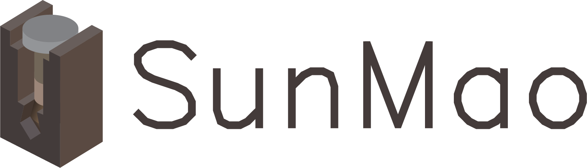

# SunMao



SunMao is a Rust audio plug-in framework. A plug-in author implements one
`SunmaoPlugin` (audio/MIDI logic plus optional view) and can export the same
implementation as VST3, CLAP, and a standalone application.

The current Phase 1 target is a usable cross-platform foundation for:

- macOS (ARM64), Windows (x86_64), and Linux (x86_64)
- VST3 and CLAP plug-ins plus standalone applications
- effect and instrument processing, MIDI, Float/Int/Bool parameters,
  sample-offset automation, reset, and parameter state round-trips
- native GL, WGPU, and WebView editor lifecycles on Cocoa, Win32, and X11
- target-aware packaging, device-free standalone smoke modes, and a CLI
  plug-in host/GUI test runner

Audio Unit support is retained as an explicit macOS experiment. It is not part
of the Phase 1 build, test, packaging, or completion gate. Advanced bus/latency
contracts, signing, installers, and universal binaries are also outside that
gate; see the [roadmap](docs/roadmap.md).

## Project Layout

| Path | Role |
| --- | --- |
| [`sunmao/core`](sunmao/core) | Format-independent audio, events, parameters, state, and view contracts |
| [`sunmao/macros`](sunmao/macros) | `#[derive(Params)]` and export helpers |
| [`sunmao/backend_vst3`](sunmao/backend_vst3) | SunMao to VST3 adapter |
| [`sunmao/backend_clap`](sunmao/backend_clap) | SunMao to CLAP adapter |
| [`sunmao/runtime`](sunmao/runtime) | Cross-platform standalone audio/MIDI runtime and smoke harness |
| [`vst3_rs`](vst3_rs), [`clap_rs`](clap_rs) | Safe-ish Rust wrappers around the raw format bindings |
| [`baseview`](baseview), [`sunmao/gui*`](sunmao) | Native window and renderer layers |
| [`tools/sunmao_packager`](tools/sunmao_packager) | VST3/CLAP/standalone validation and packaging |
| [`tools/sunmao_unittest_runner`](tools/sunmao_unittest_runner) | Scan, process, state, automation, and GUI lifecycle checks |
| [`examples/sunmao_fx_gain`](examples/sunmao_fx_gain), [`examples/sunmao_syn_sine`](examples/sunmao_syn_sine) | Reference effect and synth implementations |

The lower-level [`au_sys`](au_sys) and [`au_rs`](au_rs) crates remain in the
workspace for the deferred Audio Unit work.

## Minimal Plugin

The reference examples show the complete API. The essential shape is:

```rust,ignore
use sunmao::prelude::*;

#[derive(Params)]
struct MyParams {
    gain: FloatParam,
}

impl Default for MyParams {
    fn default() -> Self {
        Self { gain: FloatParam::new("gain", "Gain", 1.0, 0.0, 2.0) }
    }
}

struct MyPlugin { params: Arc<MyParams> }

impl Default for MyPlugin {
    fn default() -> Self { Self { params: Arc::new(MyParams::default()) } }
}

impl SunmaoPlugin for MyPlugin {
    const NAME: &'static str = "My Plugin";
    const VENDOR: &'static str = "My Company";
    const URL: &'static str = "https://example.com";
    type Params = MyParams;

    fn params(&self) -> Arc<Self::Params> { self.params.clone() }

    fn process(
        &mut self,
        buffer: &mut AudioBuffer,
        _events: &EventQueue,
        _context: &ProcessContext,
    ) -> ProcessStatus {
        buffer.apply_gain(self.params.gain.get());
        ProcessStatus::Normal
    }
}

sunmao::sunmao_export!(MyPlugin);
```

Set `crate-type = ["cdylib", "rlib"]` in the plug-in crate. The unified
library export emits both `GetPluginFactory` (VST3) and `clap_entry` (CLAP); no
format-specific code is needed in the audio callback. A standalone binary uses
the same plug-in type and a one-line entry file:

```rust,ignore
sunmao::sunmao_standalone!(my_plugin::MyPlugin);
```

Enable the facade's `standalone` feature for that binary target. With no
arguments the application opens the default audio/MIDI devices and its optional
top-level editor. Effects automatically use the default external input, while
instruments remain audio-input-free; advanced callers can override this with
`RuntimeConfig` and `InputMode`, both available from `sunmao::prelude`.
`--smoke` validates DSP/MIDI without devices and `--gui-smoke`
opens, renders, and closes the editor without opening an audio device.
The default CLAP ID is deterministically derived from `VENDOR` and `NAME`; set
`clap_info()` explicitly before publishing when a permanent reverse-domain ID
is required.

GUI plug-ins also depend only on the `sunmao` facade. Select one renderer
feature in the plug-in manifest:

```toml
[dependencies]
sunmao = { path = "../../sunmao", features = ["gui-gl", "standalone"] }
```

Use `gui-gl`, `gui-wgpu`, or `gui-webview`; each exposes its widgets, view
state, baseview adapter, and window configuration through
`sunmao::prelude::*`. The `gui-gl` feature includes the WGPU compatibility
renderer used when hosted Windows exposes only legacy WGL. `standalone` is
independent and may be combined with any renderer. Plug-in code should not
need direct dependencies on `sunmao_core`, `sunmao_macros`, `sunmao_gui`,
`sunmao_view_baseview`, or the VST3/CLAP backends.

## Build And Verify

From the repository root:

```bash
cargo test --locked
cargo fmt --all -- --check
./tools/package_examples.sh --debug --test
```

The packaging helper builds the reference examples, creates `.vst3`, `.clap`,
and platform-native standalone outputs, and runs the plug-in host checks plus
standalone DSP/MIDI smoke tests. Add `--gui-test` to exercise both embedded and
top-level GUI lifecycles. For direct inspection, build
`sunmao_packager` and `sunmao_unittest_runner` with Cargo; their command
reference is in [`tools/sunmao_packager/README.md`](tools/sunmao_packager/README.md).

Hosted run [#21](https://github.com/aizcutei/sunmao/actions/runs/31771576307) on
commit `885d2a5` accepted the historical VST3/CLAP-only gate on macOS ARM64,
Windows x86_64, and Ubuntu x86_64. It predates the corrected Phase 1 standalone
scope and cannot prove the current worktree. The current candidate must be
committed and pass the expanded three-platform workflow, including raw and
packaged standalone DSP/MIDI and GUI smoke, before Phase 1 is complete.

Current scope and deferred work are tracked in
[`docs/phase1/status.md`](docs/phase1/status.md), [`docs/phase1/progress.md`](docs/phase1/progress.md), and [`docs/roadmap.md`](docs/roadmap.md).

## Inspirations And License

SunMao builds on ideas and bindings from [clap-sys](https://github.com/micahrj/clap-sys),
[clack](https://github.com/prokopyl/clack), [vst3-sys](https://github.com/RustAudio/vst3-sys),
[baseview](https://github.com/RustAudio/baseview), and
[nih-plug](https://github.com/robbert-vdh/nih-plug).

The project is licensed under MIT OR Apache-2.0. The bundled CLAP, VST3, and
Audio Unit SDK components retain their respective upstream licenses and
trademarks.
